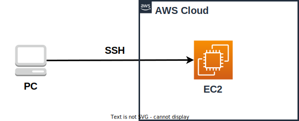

# ローカルPCにAnsible環境を構築&AWSのEC2にデプロイしてみた

---

本フォルダは`ローカルPCにAnsible環境を構築&AWSのEC2にデプロイしてみた`で使用する
テンプレートです。

以下ブログのハンズオンで使用しています。
気になる方はご覧ください。
[Qiita
](https://qiita.com/bamtech1904/items/c5a7c618154d00d32d09)
