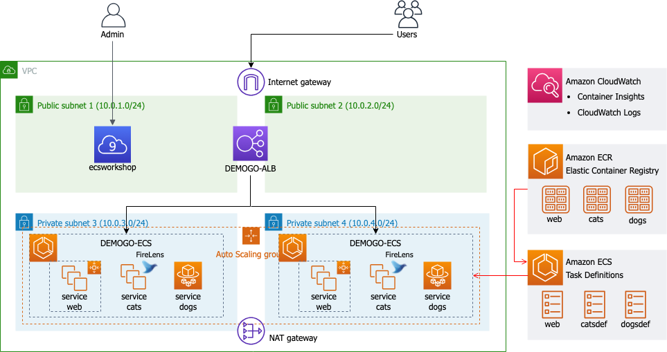

# ECS Workshop - cats and dogs

---

# Introduction
本テンプレートは、Amazon提供のAmazon ECS Workshopの内容をCloudFormationテンプレート化したもの。
ワークショップの詳細は以下を参照。

[ECS WORKSHOP - CATS AND DOGS-](https://dcj71ciaiav4i.cloudfront.net/D0B5A980-C9FC-11EB-ABD7-3362918AE194/)

# Diagram
構築するアーキテクチャは以下の通り。

- Amazon ECRにてcats、dogsのDockerイメージを作成、管理
- Amaon ECSでクラスター、タスク定義、サービスを作成して公開
  - サービスはEC2とFargateの2タイプを使用
- Application Load Balancerを通してcats and dogsアプリケーションにアクセスするようデプロイ
- CloudWatch Conateiner Insightsを用いてECSクラスターとサービスを監視
- AWS FireLensとAmazon CloudWatch Logsを使用し、コンテナログを管理
- AutoScalingでECSのサービスとクラスターを自動的にスケーリング

# How to deploy

デプロイ手順はブログにて掲載。
以下リンクを参照。

[Qiita](https://qiita.com/bamtech1904/items/9fa3744bf15bdbcc9e8b)
[Zenn](https://zenn.dev/bamtech1904/articles/20240227_ecs-workshop-cats-dogs)
